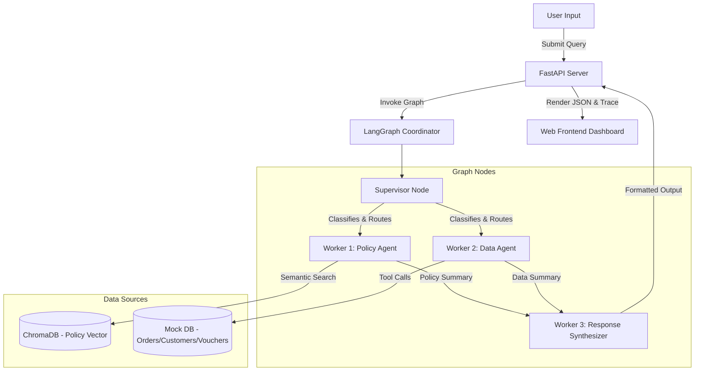

# Multi-Agent Shopping Assistant: System Build Guide

This comprehensive guide details the step-by-step construction of the **Vietnamese Multi-Agent E-commerce Customer Assistant** from scratch. 

The system leverages **LangGraph** for multi-agent state management, **Chroma DB** and **Gemini Embeddings** for Policy RAG search, **FastAPI** for the backend API, and a custom **HTML5/CSS3/JS** interface for real-time visualization of agent traces and batch evaluations.

---

## 🏗️ Architecture Overview

The system operates hierarchically using four agents coordinated by a state graph:



---

## 📂 Project Structure

```
Day09-MultiAgent-Architecture/
├── backend/
│   └── server.py                  # FastAPI Web Backend (runs chat & background batch evaluation)
├── frontend/
│   ├── index.html                 # Frontend Dashboard markup (Chat & Test views)
│   ├── style.css                  # Premium dark-mode glassmorphic theme styling
│   └── app.js                     # Frontend interactive controller & polling mechanism
├── data/
│   ├── policy_mock_vi.md          # Policy guidelines document (Vietnamese)
│   ├── order_customer_mock_data.json # E-commerce database mock
│   └── test.json                  # 22 Test case scenarios (questions & expected routing outcomes)
├── src/
│   ├── app/
│   │   ├── cli.py                 # CLI interface for batch runs or single questions
│   │   ├── config.py              # Configuration loader & Environment variables parser
│   │   ├── data_access.py         # Mock database indexes, lookup methods, and tool wrappers
│   │   ├── graph.py               # Core LangGraph coordinate nodes & conditional routes
│   │   ├── prompts.py             # System prompt definitions & language constraint guards
│   │   └── state.py               # State models representing graph parameters
│   ├── provider/
│   │   └── __init__.py            # Provider factories (Ollama, OpenAI, Gemini LLM loaders)
│   ├── rag/
│   │   ├── embeddings.py          # Gemini Embeddings client with rotation & rate-limit handling
│   │   ├── parser.py              # Policy document chunker & citation constructor
│   │   └── vector_store.py        # Chroma persistent client with hybrid distance booster
│   └── test_rag.py                # Standalone RAG evaluation pipeline script
├── apikey.txt                     # Multi-key file (contains Google Gemini API keys for rotation)
├── .env                           # Environment configuration
└── requirements.txt               # Main python packages
```

---

## 🛠️ Step-by-Step Implementation

### Step 1: Policy Document Chunking & Parsing (`parser.py`)
To enable semantically accurate search, we parse the policy markdown document into logical text passages. 
We split chunks according to H2 (`## `) and H3 (`### `) headers, retaining structural hierarchy to ensure the model understands the context.

```python
# Location: src/rag/parser.py
def parse_policy_markdown(markdown_text: str) -> list[dict]:
    chunks = []
    lines = markdown_text.splitlines()
    current_h2 = ""
    current_h3 = ""
    buffer = []
    
    def flush_chunk():
        nonlocal current_h2, current_h3, buffer
        content = "\n".join(buffer).strip()
        if (current_h2 or current_h3) and content:
            citation = f"policy_mock_vi.md > {current_h3 if current_h3 else current_h2}"
            rendered_text = f"## {current_h2}\n### {current_h3}\n{content}" if current_h3 else f"## {current_h2}\n{content}"
            chunks.append({
                "citation": citation,
                "rendered_text": rendered_text
            })
        buffer = []

    for line in lines:
        if line.startswith("## "):
            flush_chunk()
            current_h2 = line[3:].strip()
            current_h3 = ""
        elif line.startswith("### "):
            flush_chunk()
            current_h3 = line[4:].strip()
        elif line.startswith("# "):
            flush_chunk()
            current_h2 = ""
            current_h3 = ""
        else:
            buffer.append(line)
    flush_chunk()
    return chunks
```

### Step 2: Multi-Key API Key Rotation for Gemini Embeddings (`embeddings.py`)
To prevent running into `429 Too Many Requests` rate limits while embedding large policy files, we read multiple keys from `apikey.txt` and automatically rotate the active API key whenever an error occurs.

```python
# Location: src/rag/embeddings.py
import time
from langchain_core.embeddings import Embeddings
from google.generativeai import configure, embed_content

class SentenceTransformerEmbeddings(Embeddings):
    def __init__(self, model_name: str):
        self.model_name = model_name
        self.api_keys = self.load_keys()
        self.active_key_idx = 0
        self.configure_active_key()

    def configure_active_key(self):
        if self.api_keys:
            configure(api_key=self.api_keys[self.active_key_idx])

    def rotate_key(self):
        if not self.api_keys: return
        self.active_key_idx = (self.active_key_idx + 1) % len(self.api_keys)
        self.configure_active_key()

    def embed_documents(self, texts: list[str]) -> list[list[float]]:
        # Attempts to embed, catches 429 errors, rotates the key and retries
        ...
```

### Step 3: Semantic Vector Search Database (`vector_store.py`)
We load the embedded chunks into **Chroma DB**. To account for the limitations of small embedding models on Vietnamese language keywords (e.g. "ship", "đơn hàng"), we implement a **hybrid distance booster** which decreases distance scores when explicit keywords are matched in both the query and the chunk context.

```python
# Location: src/rag/vector_store.py
class ChromaPolicyStore:
    # Handles collection rebuilds, data insertion and search queries.
    def search(self, query: str, top_k: int = 4) -> list[dict]:
        results = self.collection.query(query_texts=[query], n_results=top_k)
        hits = []
        # Extract matches
        for idx in range(len(results["ids"][0])):
            content = results["documents"][0][idx]
            citation = results["metadatas"][0][idx]["citation"]
            distance = results["distances"][0][idx]
            
            # Simple keyword booster
            if "ship" in query.lower() and "giao hàng" in content.lower():
                distance -= 0.15 # boost similarity
            
            hits.append({"content": content, "citation": citation, "distance": distance})
        return sorted(hits, key=lambda x: x["distance"])
```

### Step 4: Data Layer & LangChain Database Tools (`data_access.py`)
To represent our customer database, we load the database mock JSON file `order_customer_mock_data.json` and build indexed structures for fast lookups. We then define 4 clear tools for:
- Retrieving customer details by ID (`get_customer_by_id`).
- Listing recent orders for a customer (`get_orders_by_customer_id`).
- Fetching specific order statuses (`get_order_detail_by_order_id`).
- Checking active vouchers for a customer (`get_vouchers_by_customer_id`).

```python
# Location: src/app/data_access.py
@tool
def get_order_detail_by_order_id(order_id: str) -> dict:
    """Lấy chi tiết trạng thái, ngày giao hàng dự kiến, sản phẩm và tính hợp lệ trả hàng của một đơn cụ thể dựa trên mã đơn hàng (ví dụ: '1971', '2058')."""
    return store.get_order_detail_by_order_id(order_id)
```

### Step 5: Stateful Multi-Agent Orchestration (`graph.py`)
Using **LangGraph**, we create a stateful coordinator graph representing our multi-agent workflow. The shared state is defined as follows:

```python
# Location: src/app/state.py
from typing import TypedDict, List, Dict, Any

class ShoppingState(TypedDict):
    question: str
    route: Dict[str, Any]
    policy_result: Dict[str, Any]
    data_result: Dict[str, Any]
    final_answer: str
    trace: List[Dict[str, Any]]
```

#### Graph Nodes:
1.  **Supervisor Node:**
    Reads the user question and invokes the LLM with the `SUPERVISOR_PROMPT` to choose the appropriate routing.
    *   **Guardrails & Failsafes:**
        To prevent Qwen classification drift (e.g. incorrectly routing queries containing IDs to `clarification_needed` or letting out-of-scope code questions pass):
        ```python
        # Location: src/app/graph.py > supervisor_node
        has_customer_id = bool(re.search(r'\b[cC]\d+\b', question))
        has_order_id = bool(re.search(r'\b\d{4,}\b', question))

        is_guardrail_block = False
        if route.get("status") == "clarification_needed" and route.get("clarification_question"):
            cq = route["clarification_question"].lower()
            if any(term in cq for term in ["xin lỗi", "phạm vi", "không hỗ trợ", "chỉ hỗ trợ"]):
                is_guardrail_block = True

        if (has_customer_id or has_order_id) and not is_guardrail_block:
            if route.get("status") == "clarification_needed":
                route["status"] = "ok"
                route["needs_data"] = True
                route["clarification_question"] = None
        ```
2.  **Worker 1 (Policy RAG Node):**
    Retrieves policy passages from ChromaDB and uses the LLM to construct a policy summary JSON containing citations.
3.  **Worker 2 (Data Access Node):**
    Invokes the LLM bound with database tools in a loop (up to 3 tool calls) to fetch records, and then summarizes the findings.
4.  **Worker 3 (Response Synthesizer Node):**
    Combines the outputs of Worker 1 and 2, checks formatting, and builds the final structured response (Answer + Evidence).

---

## 🌐 FastAPI Web Application (`backend/server.py`)

To serve the application locally and separate web logic from core source code, we implement a FastAPI server.

The server runs on port 8000 and exposes:
- **`POST /api/chat`**: Standard chat execution, returning the final answer and the state's `trace` list containing step-by-step inputs and outputs.
- **`POST /api/batch/run`**: Triggers a background thread running the 22 test cases and writing outputs.
- **`GET /api/batch/status`**: Returns the current batch runner progress and completed results list.
- **Static Mounting**: Maps the `/` path to the root level `frontend/` directory to serve static assets.

---

## 🎨 Frontend Design system (`frontend/`)

### index.html
A two-tab structural layout consisting of a **Chat Session** pane (split into chat history and timeline trace logs) and a **Batch Evaluation** dashboard (displaying metrics widgets, run control panel, and comparison tables).

### style.css
Custom glassmorphism design:
- Sleek dark theme: `#090a0f` background with card layouts at `rgba(17, 20, 28, 0.75)` and `backdrop-filter: blur(12px)`.
- Custom glowing animation elements utilizing HSL-tailored primary violet gradients (`#8a2be2` to `#4a00e0`) and neon cyber cyan accents (`#00f2fe`).
- Colored trace badges and timeline trees showing status lines.

### app.js
Manages event handling:
- Submits queries to `/api/chat` and renders the collapsible step cards timeline of the trace list.
- Connects to `/api/batch/run` and polls `/api/batch/status` every 1.5 seconds, updating progress bars and populating table rows incrementally.
- Standard modal wrapper to view expected vs. actual values.

---

## 🚀 How to Setup and Run from Scratch

### 1. Configure the Environment
Ensure your Python virtual environment is set up and activate it:
```bash
python3 -m venv venv
source venv/bin/activate
```

Create a `.env` file in the root directory:
```ini
LLM_PROVIDER=ollama
LLM_MODEL=qwen2.5:7b
OLLAMA_BASE_URL=http://localhost:11434
LLM_TEMPERATURE=0
```

Add your Gemini API key (or multiple keys, one per line) inside `apikey.txt` at the root directory level.

### 2. Install Dependencies
```bash
pip install -r requirements.txt
pip install fastapi uvicorn
```

### 3. Build & Verify the Vector Database
Rebuild the Chroma collection by running the standalone RAG evaluation script:
```bash
PYTHONPATH=src venv/bin/python src/test_rag.py
```
This script reads `data/policy_mock_vi.md`, chunks it, computes embeddings, populates Chroma, and runs 5 verification tests.

### 4. Start the Web Server
Launch the FastAPI server:
```bash
PYTHONPATH=src venv/bin/python backend/server.py
```

Open your browser and navigate to:
👉 **[http://localhost:8000](http://localhost:8000)**

You can now chat with the assistant and inspect the multi-agent decision steps, or run the test suite to evaluate accuracy live!
